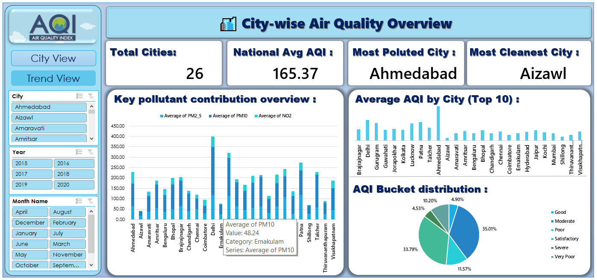
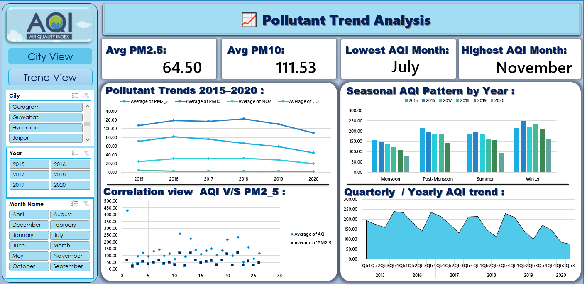
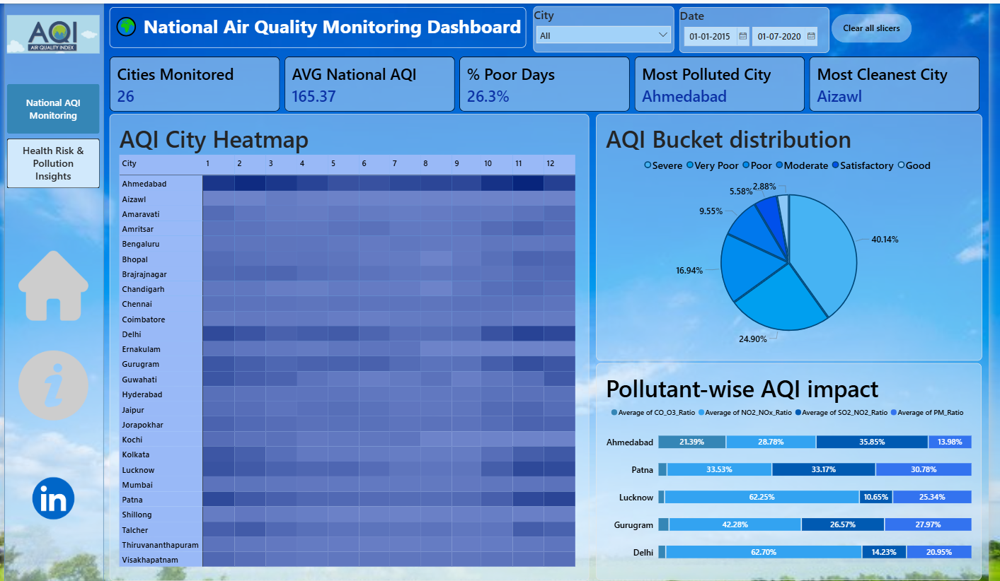
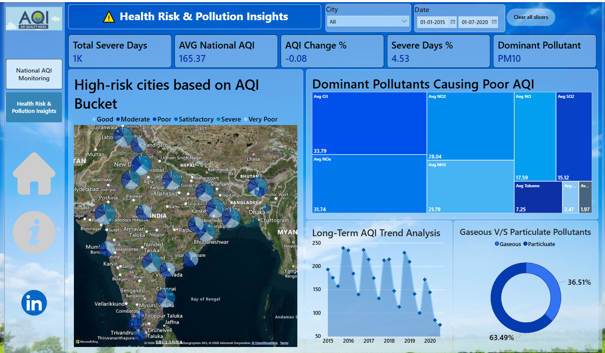

# 🌍 AQI-Analytics-Project

## 📌 Project Overview

This project is a complete **Air Quality Index (AQI) Analytics** developed using:

- **MySQL** for database storage and SQL analytics
- **Python** for data extraction, cleaning, transformation, and visualization
- **Excel Dashboards** for interactive reporting
- **Power BI Dashboards** for advanced business intelligence insights

The project demonstrates a full **Data Analytics workflow** from raw AQI data ingestion to interactive dashboard reporting.

---

# 🚀 Objectives

The main objectives of this project are:

✅ Import and store raw AQI data in MySQL  
✅ Extract AQI data from MySQL using Python  
✅ Clean and standardize air quality data  
✅ Load cleaned data back into MySQL  
✅ Perform advanced SQL analytics using joins, subqueries, and window functions  
✅ Generate business insights using Python visualizations  
✅ Build interactive dashboards in Excel and Power BI  

---

# 🛠️ Technologies Used

| Technology | Purpose |
|------------|----------|
| MySQL | Database Management |
| Python | Data Processing |
| Pandas | Data Cleaning |
| NumPy | Numerical Analysis |
| Matplotlib | Visualization |
| Seaborn | Statistical Charts |
| SQLAlchemy | Database Connection |
| Excel | Interactive Dashboard |
| Power BI | Business Intelligence |

---

# 📂 Project Workflow

## 🔹 Problem Statement 1: Raw AQI Data Ingestion

### Objective
Store raw air quality data safely for analysis.

### Tasks Performed
- Imported AQI dataset into MySQL raw table
- Validated:
  - Data types
  - NULL values
  - Duplicate records
- Preserved raw dataset for auditing and comparison

---

## 🔹 Problem Statement 2: Data Extraction from MySQL to Python

### Tasks Performed
- Connected MySQL with Python
- Extracted complete AQI dataset
- Verified row counts between MySQL and Python
- Identified inconsistencies in stored and fetched data

---

## 🔹 Problem Statement 3: Data Cleaning & Standardization in Python

### Objective
Improve data quality for accurate analysis.

### Cleaning Operations
- Handled missing pollutant values
- Standardized:
  - City names
  - AQI bucket categories
- Removed invalid pollutant readings
- Created derived columns:
  - Monthly AQI
  - Pollutant ratios
  - Seasonal categories

---

## 🔹 Problem Statement 4: Loading Cleaned Data Back into MySQL

### Objective
Maintain structured, analysis-ready tables.

### Tasks Performed
- Created cleaned AQI table
- Inserted transformed data into MySQL
- Verified data consistency

---

## 🔹 Problem Statement 5: Advanced SQL Analytics

### Objective
Generate insights using SQL-only analysis.

### SQL Concepts Used

### ✅ Joins
- Joined AQI tables with:
  - City tables
  - Month tables
  - Summary tables

### ✅ Subqueries
- Identified cities with AQI above national average
- Retrieved highly polluted cities

### ✅ Window Functions
- Ranked cities by AQI within each year
- Calculated moving average AQI

### ✅ DQL & DML
- Maintained summary tables
- Generated AQI reports

---

## 🔹 Problem Statement 6: Visualization & Insight Generation

### Objective
Convert SQL results into meaningful business insights.

### Visualizations Created
- AQI trend analysis
- Pollutant contribution by city
- AQI bucket distribution
- Seasonal AQI analysis
- Correlation analysis between AQI and pollutants
- Heatmaps and comparative charts

---

# 📊 Excel Dashboards

---

# 📈 Dashboard 1: City-wise Air Quality Overview

## Purpose
Quick comparison of air quality across cities.

## Dashboard Insights
- Average AQI by city
- AQI bucket distribution
- Top polluted and cleanest cities
- Pollutant contribution overview
- KPI Cards for AQI insights

## Features
- Interactive slicers
- Dynamic filtering
- City and Year selection

---

# 📈 Dashboard 2: Pollutant Trend Analysis

## Purpose
Analyze pollutant behavior over time.

## Dashboard Insights
- PM2.5, PM10, NO2, CO trends
- Monthly and yearly AQI trends
- Seasonal AQI impact
- Correlation between AQI and pollutants

## Features
- Time-series charts
- Seasonal trend analysis
- Interactive KPI cards

---

# 📊 Power BI Dashboards

---

# 📉 Dashboard 1: National Air Quality Monitoring Dashboard

## Dashboard Insights
- City-wise AQI heatmap
- AQI bucket distribution
- Pollutant-wise AQI impact
- Real-time style city/date filtering
- National AQI monitoring KPIs

---

# 📉 Dashboard 2: Health Risk & Pollution Insights

## Purpose
Analyze pollution severity and health risk patterns.

## Dashboard Insights
- High-risk cities by AQI bucket
- Dominant pollutants causing poor AQI
- Long-term AQI trends
- Gaseous vs particulate pollutant comparison

---

# 📌 Key Insights

- Ahmedabad recorded the highest AQI levels.
- Aizawl emerged as one of the cleanest cities.
- Winter season showed maximum AQI spikes.
- PM10 and PM2.5 were dominant pollutants.
- AQI levels improved significantly during monsoon seasons.

---

# 📚 Learning Outcomes

This project demonstrates practical skills in:

- Data Engineering
- SQL Analytics
- Python Data Cleaning
- Data Visualization
- Dashboard Development
- Business Intelligence
- KPI Reporting

---

# 👨‍💻 Author

Krish Makwana 

🔗 LinkedIn:  
[Krish Makwana](https://www.linkedin.com/in/krish-makwana-58ab64374/)
---

# ⭐ Support

If you found this project useful, give it a ⭐ on GitHub.
